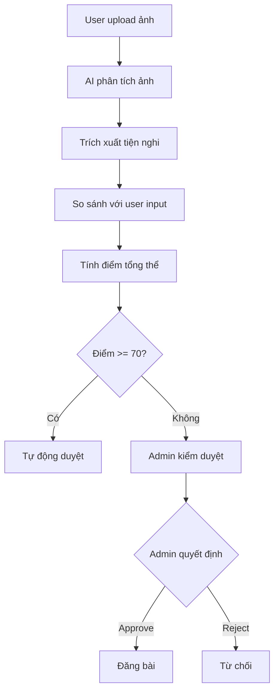

# 🤖 HỆ THỐNG AI NHẬN DIỆN TIỆN NGHI & KIỂM DUYỆT BÀI ĐĂNG

## 📋 TỔNG QUAN

Hệ thống sử dụng **Google Gemini Vision AI** để:
- ✅ Nhận diện tiện nghi từ ảnh phòng
- ✅ So sánh với thông tin người dùng nhập
- ✅ Đánh giá chất lượng bài đăng
- ✅ Hỗ trợ admin kiểm duyệt tự động

---

## 🎯 TÍNH NĂNG CHÍNH

### 1. **Nhận Diện Tiện Nghi Tự Động**
- Phân tích ảnh và phát hiện: Điều hòa, Giường, Tủ lạnh, Bàn ghế, Bếp, Máy giặt, v.v.
- Đánh giá chất lượng phòng (mới/cũ, sạch sẽ, ánh sáng)
- Ước tính diện tích phòng

### 2. **So Sánh & Xác Thực**
- So sánh tiện nghi user nhập vs AI phát hiện
- Tính accuracy score (%)
- Cảnh báo nếu thông tin không khớp

### 3. **Đánh Giá Tổng Thể**
Điểm từ 0-100 dựa trên:
- 40% - Độ chính xác tiện nghi
- 30% - Chất lượng ảnh
- 15% - Số lượng ảnh (tối ưu 5-8 ảnh)
- 15% - Tình trạng phòng

### 4. **Hỗ Trợ Admin Kiểm Duyệt**
- Dashboard quản lý bài đăng chờ duyệt
- Hiển thị kết quả AI ngay lập tức
- Phê duyệt/từ chối với ghi chú

---

## 🚀 CÁCH SỬ DỤNG

### **A. Cho Người Đăng Tin (Landlord)**

#### Bước 1: Đăng nhập
```
Truy cập: /auth/login
```

#### Bước 2: Tạo bài đăng
```
Truy cập: /property/create
```

#### Bước 3: Upload ảnh (Step 4)
- Upload ít nhất 2 ảnh → **AI tự động phân tích**
- Hệ thống hiển thị:
  - ✅ Tiện nghi được phát hiện
  - 📊 Độ chính xác
  - 💡 Gợi ý cải thiện

#### Bước 4: Điền thông tin
- AI sẽ **tự động tick** các tiện nghi phát hiện được
- Bạn có thể điều chỉnh nếu cần

#### Bước 5: Submit
- Hệ thống đánh giá tổng thể
- Hiển thị điểm AI (0-100)
- Yêu cầu xác nhận trước khi gửi

**Kết quả có thể:**
- ✅ Điểm ≥ 70: Tự động duyệt (khuyến nghị)
- ⚠️ Điểm 50-69: Cần admin xem xét
- ❌ Điểm < 50: Có thể bị từ chối

---

### **B. Cho Admin**

#### Bước 1: Truy cập dashboard
```
URL: /admin/moderation
```

#### Bước 2: Xem danh sách chờ duyệt
- Hiển thị tất cả bài đăng `status: pending`
- Có điểm AI (nếu có)
- Thông tin landlord

#### Bước 3: Kiểm duyệt
1. Click "Xem chi tiết & Kiểm duyệt"
2. AI tự động phân tích lại
3. Hiển thị:
   - Điểm tổng thể
   - Tiện nghi xác nhận/không khớp
   - Chất lượng ảnh
   - Gợi ý hành động

#### Bước 4: Quyết định
- ✅ **Phê duyệt**: Bài đăng → `status: available`
- ❌ **Từ chối**: Bài đăng → `status: inactive`
- Có thể thêm ghi chú cho landlord

---

## 📊 CẤU TRÚC DỮ LIỆU

### **Property Model - Thêm Field**
```javascript
aiModeration: {
  evaluatedAt: Date,              // Thời gian đánh giá
  totalScore: Number,             // Điểm 0-100
  recommendation: String,         // 'approved' | 'review' | 'rejected'
  amenitiesAccuracy: Number,      // % chính xác tiện nghi
  imageQuality: Object,           // Chi tiết chất lượng ảnh
  detectedAmenities: [String],    // Tiện nghi AI phát hiện
  missingAmenities: [String],     // Tiện nghi thiếu
  extraAmenities: [String],       // Tiện nghi thừa
  adminAction: String,            // 'approve' | 'reject'
  adminNotes: String,             // Ghi chú admin
  adminId: ObjectId               // ID admin xử lý
}
```

---

## 🔌 API ENDPOINTS

### **1. Phân tích nhiều ảnh**
```http
POST /api/moderation/analyze-images
Authorization: Bearer <token>

Body:
{
  "imagePaths": ["/uploads/img1.jpg", "/uploads/img2.jpg"]
}

Response:
{
  "success": true,
  "summary": {
    "totalImages": 2,
    "allDetectedAmenities": ["Điều hòa", "Giường", "Tủ quần áo"],
    "averageConfidence": 0.85,
    "primaryRoomType": "phòng ngủ"
  },
  "details": [...]
}
```

### **2. Đánh giá bài đăng**
```http
POST /api/moderation/evaluate
Authorization: Bearer <token>

Body:
{
  "type": "phong-tro",
  "amenities": ["Điều hòa", "Wifi", "Giường"],
  "images": ["/uploads/img1.jpg", "/uploads/img2.jpg"],
  ...
}

Response:
{
  "success": true,
  "evaluation": {
    "totalScore": 85,
    "recommendation": "approved",
    "amenitiesComparison": {
      "verified": ["Điều hòa", "Giường"],
      "notDetected": ["Wifi"],
      "accuracyScore": 67
    },
    "imageQuality": {...}
  }
}
```

### **3. So sánh tiện nghi**
```http
POST /api/moderation/compare-amenities
Authorization: Bearer <token>

Body:
{
  "userAmenities": ["Điều hòa", "Wifi", "Giường"],
  "imagePaths": ["/uploads/img1.jpg"]
}
```

### **4. Lấy bài chờ duyệt (Admin)**
```http
GET /api/moderation/pending
Authorization: Bearer <token> (Admin only)

Response:
{
  "success": true,
  "count": 5,
  "data": [...]
}
```

### **5. Kiểm duyệt bài đăng (Admin)**
```http
POST /api/moderation/review/:propertyId
Authorization: Bearer <token> (Admin only)

Body:
{
  "action": "approve",  // or "reject"
  "adminNotes": "Bài đăng đạt chuẩn"
}
```

---

## 🎨 GIAO DIỆN

### **1. Form đăng tin (property-create.html)**
- Upload ảnh → AI tự động phân tích
- Hiển thị kết quả ngay trong form
- Tự động tick tiện nghi phát hiện được
- Modal xác nhận với điểm AI

### **2. Admin Dashboard (admin-moderation.html)**
- Danh sách bài chờ duyệt
- Filter theo trạng thái, điểm AI
- Modal chi tiết với kết quả AI
- Nút phê duyệt/từ chối

---

## ⚙️ CẤU HÌNH

### **1. Cài đặt package**
```bash
npm install axios  # Nếu chưa có
```

### **2. Cấu hình .env**
```env
GEMINI_API_KEY=your-gemini-api-key-here
```

### **3. Import routes trong app.js**
```javascript
app.use('/api/moderation', require('./routes/moderationRoutes'));
```

### **4. Thêm script vào property-create.html**
```html
<script src="/js/ai-moderation.js"></script>
<script src="/js/property-create.js"></script>
```

---

## 📈 QUY TRÌNH HOẠT ĐỘNG



---

## 💡 GỢI Ý CẢI TIẾN

### **Tương lai gần:**
1. ✅ Train model riêng với dataset phòng Việt Nam
2. ✅ Thêm nhận diện tình trạng pháp lý (chứng nhận, hợp đồng)
3. ✅ Phát hiện ảnh giả/photoshop
4. ✅ Đề xuất giá tự động dựa trên ảnh
5. ✅ Chatbot tư vấn cải thiện điểm AI

### **Tương lai xa:**
1. Video walkthrough analysis
2. 3D reconstruction từ ảnh
3. AR preview phòng
4. Blockchain cho xác thực ảnh

---

## 🐛 XỬ LÝ LỖI

### **Lỗi thường gặp:**

#### 1. API Key không hợp lệ
```
Error: GEMINI_API_KEY not found
→ Kiểm tra file .env
```

#### 2. Ảnh quá lớn
```
Error: Image size exceeds limit
→ Resize ảnh < 5MB
```

#### 3. Không đọc được ảnh
```
Error: Cannot read image file
→ Kiểm tra đường dẫn ảnh
```

#### 4. JSON parse error
```
→ Gemini trả về text thay vì JSON
→ Hệ thống tự động fallback
```

---

## 🎯 ĐÁNH GIÁ HIỆU QUẢ

### **Metrics cần theo dõi:**
- ✅ Tỷ lệ auto-approve (mục tiêu: > 60%)
- ✅ Accuracy của AI (so với human review)
- ✅ Thời gian kiểm duyệt trung bình
- ✅ Tỷ lệ khiếu nại từ landlord
- ✅ User satisfaction score

---

## 📞 HỖ TRỢ

Nếu có vấn đề:
1. Check console log
2. Xem error trong Network tab
3. Kiểm tra API key
4. Contact: support@homerent.vn

---

**Phiên bản:** 1.0.0  
**Cập nhật:** 26/10/2025  
**Người phát triển:** GitHub Copilot AI Assistant 🤖
